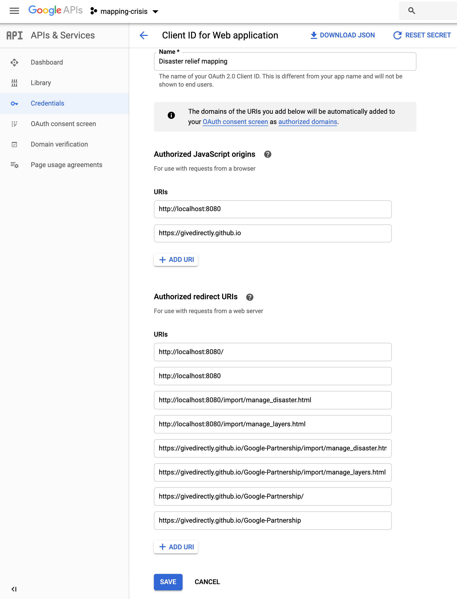

# Instructions for Initial Setup

This is a reference for the steps taken to set this app up the first time.
**None of these steps should have to be performed again**, but they may be a
useful reference when troubleshooting.

As well, if for some reason you need to set up a new instance of the app (if you
are a different organization, for instance), read on.

## Moving to a different server for the mapping page

Our current server setup is GitHub Pages. We serve from the `master` branch,
`docs` folder:

Because the application is all client-side JavaScript, any static web host
(WordPress, a blog, etc.) should work as a server. Simply copy all the files
from [docs/](./docs) and its subdirectories to the location you're serving from.

To make the [Token Server](./token_server/README.md) work with the new location,
you must update the `allowedOrigins` field in
[token_server.js](./token_server/token_server.js) to be the new server's domain.

## Moving to a different Google account/Changing server setup

While the application is client-side JavaScript, it talks to two Google
services, [EarthEngine](https://earthengine.google.com) and
[Firestore](https://firestore.google.com). The resources it accesses are owned
by the "Admin account", `gd-earthengine-user@givedirectly.org`, but can be
accessed by any EarthEngine-whitelisted user, and by any Google user,
respectively (some Firestore data is available only to specific users, see
below).

To set up a brand-new system with new Google accounts:

1.  Create a Google account and sign into it. This is your new Admin account.
    All the remaining steps should be done while logged into this account,
    ideally in a browser window that isn't logged into any other account, for
    simplicity.

1.  Request [EarthEngine whitelisting](https://signup.earthengine.google.com/)
    for this Admin account.

1.  Go to https://console.firebase.google.com/. You should have to create a
    project. (The current project is "mapping-crisis".) You don't need to
    enable Google Analytics or anything else fancy: we are only using this as
    data storage. Once the project is created, click on "Database" and "Create
    database".

1.  Follow instructions to
[modify/set up firestore rules](#modifyset-up-firestore-rules).

1.  Go to the Firestore database. To get there, click on "Database" in the left-
    hand sidebar.
    [Here](https://firebase.corp.google.com/project/mapping-crisis/database/firestore/data~2F)
    is the current page.

1.  Create a collection called `ALLOWED_USERS`. In that collection, create a
    document called `ALL_USERS`. In that document, create a field of array type
    called `USERS`. To that array, add the email addresses of users who should
    be able to view/edit user-defined features on the map. The current data
    looks like: 

1.  Go to [Credentials](https://console.developers.google.com/apis/credentials),
    or "Credentials" under https://console.developers.google.com/ if that link
    does not work.

1.  Setting up an API Key.

    -  You should see an "API Keys" section, and under that "Browser key (auto
       created by Firebase)", or similar:
       
       Click on it.

    -  Rename the key so it's easier to track (for instance, the current key is
       called "Mapping browser key") and set API restrictions. Choose the
       following five APIs:
           -   Maps JavaScript API
           -   Google Earth Engine API
           -   Identity Toolkit API
           -   Places API
           -   Token Service API (only needed for optional token server)
  
       
  
       Remember to save your changes!

    -  Copy the API key to the `API_KEY` constant in 
       [common_auth_utils.js](./docs/common_auth_utils.js). Also copy it at the
       end of the `script` tag for the Maps API in
       [index.html](./docs/index.html),
       [manage_disaster.html](./docs/import/manage_disaster.html), and
       [script_loader.js](./cypress/support/script_loader.js).

1.  Setting up OAuth client ID.

    -  Go back to the
       [Credentials](https://console.developers.google.com/apis/credentials)
       page. Below the "API Keys" section is an OAuth 2.0 Client IDs section. It
       should have an auto-generated one. Click on it.

    -  Give it a useful name (the current one is "Disaster relief mapping").
  
    -  Specify "Authorized JavaScript origins". Currently they are
       `http://localhost:8080` for local development and
       `https://givedirectly.github.io`. This second origin should be the domain
       that the mapping page is hosted on.
  
    -  Specify "Authorized redirect URIs". You must list here every page that a
       normal user or the Admin user might go to in the app, including when
       managing a disaster. Currently, it is `http://localhost:8080`,
       `http://localhost:8080/`, `http://localhost:8080/manage_disaster.html`,
       `http://localhost:8080/manage_layers.html`,
       `https://givedirectly.github.io/Google-Partnership/import/manage_disaster.html`,
       `https://givedirectly.github.io/Google-Partnership/import/manage_layers.html`,
       `https://givedirectly.github.io/Google-Partnership/`,
       `https://givedirectly.github.io/Google-Partnership`. Save your changes.

    -  Screenshot of current state for the instructions above:
       

    -  Copy the "Client ID" field to the `CLIENT_ID` constant in
       [common_auth_utils.js](./docs/common_auth_utils.js) and
       [token_server.js](./token_server/token_server.js).

### Set up testing infrastructure

#### Set up test data
 
Data from Hurricane Harvey (2017) must be present, since our integration tests
assert against it.

-  As the Admin account (currently `gd-earthengine-user@givedirectly.org`), go
   to the
   [manage disaster](https://givedirectly.github.io/Google-Partnership/import/manage_disaster.html)
   page and add a disaster named `harvey` in `2017`, with Texas the affected
   state, if it does not already exist.

-  Follow [instructions](https://docs.google.com/document/d/1WnjHIexMnlVkn5lqnzYlBVg4aWxh2wVDZI2DBAu-TGI/edit?disco=AAAAEE2MdUU&ts=5e1368bd&usp_dm=true)
   to create a score asset, using the FEMA Damage Assessments damage asset
   currently available in the Admin account's `2017-harvey` folder, and Texas
   data obtained as per the instructions.

-  If your data differs significantly from that originally used, you may have
   to adjust test parameters to get them to pass again.

### Set up test account

In order to successfully run tests, locally or on a GitHub workflow, a Test
account must be set up, and developers and the GitHub workflow must have access
to its credentials. The current Test account is
`gd-earthengine-test-user@givedirectly.org`.

-  If you need to create a new Test account, follow the first four steps of
   [Moving to a different Google account/Changing server setup](#moving-to-a-different-google-accountchanging-server-setup):
   create an account and whitelist it, create a Firestore database, and
   initialize its rules. Note that the test project's name can/should be
   different from the prod name: currently the test project's name is
   `mapping-test-data`. Similarly in the
   [Modify/set up Firestore rules](#modifyset-up-firestore-rules), deploy from
   the `test` subdirectory to the test project.

-  Go "Settings > Project Settings > Service Accounts" in the
   [Firebase console](https://console.firebase.google.com). It should look like
   this: 

-  Follow the
   [instructions](https://developers.google.com/earth-engine/service_account) to
   whitelist that service account.

-  From the Firebase console, click on "Generate new private key" for this
   service account and download it.

-  Distribute the downloaded JSON file to team members. Alternately, each of
   them can generate their own.

-  Generate another private key.

-  If you are an administrator of the repository, put the contents of the private
  key (as JSON) in a secret named `TESTING_SERVICE_ACCOUNT_SECRET_JSON`
  following
  [these instructions](https://docs.github.com/en/actions/security-guides/using-secrets-in-github-actions#creating-secrets-for-a-repository).

-  If you are not an administrator, but only a collaborator, then set up the
   [`gh` command-line tool](https://cli.github.com/). Follow the standard
   instructions there to authenticate.

   -  Get the organization public key following
      [these instructions](https://docs.github.com/en/rest/actions/secrets#get-an-organization-public-key).
      Also note the `key_id` returned here.

   -  Encrypt the private key generated above using [these instructions](https://docs.github.com/en/rest/guides/encrypting-secrets-for-the-rest-api#example-encrypting-a-secret-using-python),
      with the public key you retrieved just now.

   -  Create a repository secret called `TESTING_SERVICE_ACCOUNT_SECRET_JSON`
      using [these instructions](https://docs.github.com/en/rest/actions/secrets#create-or-update-a-repository-secret),
      with `key_id` the id that was returned along with the public key above and
      value the encrypted private key.

-  To record GitHub workflow runs to the Cypress Cloud dashboard, go to
   https://cloud.cypress.io/projects/jr8ks8/settings/general (or the settings
   of the project if you've created a new one) and copy a "record key". Store it
   as a GitHub secret called `CYPRESS_RECORD_KEY`, following the instructions
   above.

-  [Enable EarthEngine API](https://console.cloud.google.com/apis/api/earthengine.googleapis.com/overview)
   for Test account in the developer console.

### Modify/set up Firestore rules

-  One-time: install `firebase-tools` globally:
   `yarn global add firebase-tools`. (Install [yarn](http://yarnpkg.com/) if
   necessary first.) 

-  Go to the [firestore_rules/prod](./firestore_rules/prod) subdirectory.

-  Run `firebase login` and log in as the Admin user.

-  If desired, edit Firestore rules at
   [firestore_rules/prod/firestore.rules](./firestore_rules/prod/firestore.rules).
   See
   [rules documentation](https://firebase.google.com/docs/firestore/security/rules-structure).

-  Deploy rules by running
   `firebase deploy --project mapping-crisis --only firestore:rules`. If
   the project name has changed, specify it instead of `mapping-crisis`.

-  To edit/deploy test rules, switch to the
   [firestore_rules/test](./firestore_rules/test) subdirectory and repeat. This
   time, you will have to log in as the test user and specify the test project.

-  If the project is no longer `mapping-crisis` or the test project is no longer
   `mapping-test-data`, you _may_ have to modify the
   [.firebaserc](./firestore_rules/prod/.firebaserc) file (or the corresponding
   test [.firebaserc](./firestore_rules/test/.firebaserc) file).
